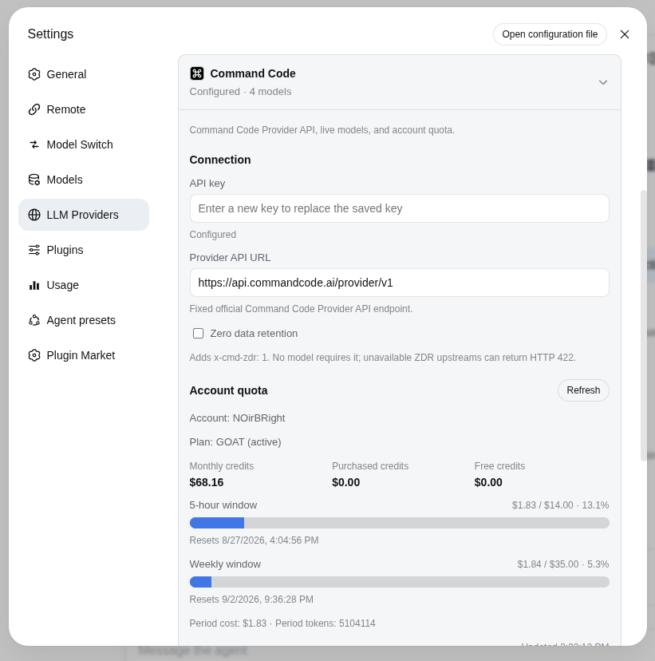
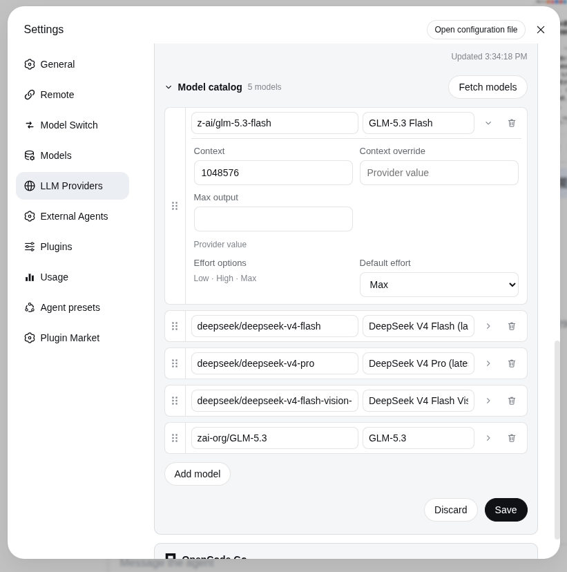

# dsh-llm-commandcode

English | [中文](README.zh.md)

Command Code Provider API chat for DeepSeek Harness. This plugin is a separate provider route (`commandcode`) and settings namespace (`llm-commandcode`). Chat uses the documented [Provider API](https://commandcode.ai/docs/provider) through DSH `PiAiAdapter`. Account quota is a Host-only, best-effort extra and never blocks chat.

The package root exposes the Cordis plugin contract. The same artifact exports `./client`, which contributes the Command Code card under Settings → LLM Providers.

Compatibility: this release requires DeepSeek Harness `0.1.2-alpha.4` and `@deepseek-ai/cordis@4.0.2`; it is not compatible with Alpha.1–Alpha.3. Users on older runtimes must keep the last plugin tag built for that runtime.

## LLM Providers UI ownership

The **LLM Providers** Settings page (`settings.section` `id: providers` with child `settings.provider.item`) and the shared `llm-providers` order store are owned solely by `dsh-llm-providers-ui`.

- This plugin contributes only its keyed card (`key: llm-commandcode`) and its Host `llm` route; it does not install the page or the shared `llm-providers` namespace. Load order with the owner does not matter.
- Without the owner (Headless or Web without `dsh-llm-providers-ui`): the Host model route `commandcode` still works; in Web the Providers page and this card are omitted and the browser console warns that the owner is missing. A Web release composition test rejects a bundle graph that ships provider cards without the owner.
- The nav globe glyph is a temporary Alpha.4 DOM adapter owned only by `dsh-llm-providers-ui` (`src/client/nav-icon.ts`); this plugin does not ship that adapter.

Install `dsh-llm-providers-ui` explicitly in the profile alongside provider plugins (see that package's `cordis.patch.yml`).

## Installation

DeepSeek Harness `0.1.2-alpha.4` is required. Install directly from GitHub:

~~~sh
dsh plugin --profile web add --force \
  https://github.com/NOirBRight/dsh-llm-providers-ui/releases/download/v0.1.3/dsh-llm-providers-ui-0.1.3.tgz
dsh plugin --profile web add --force \
  https://github.com/NOirBRight/dsh-llm-commandcode/releases/download/v0.1.18/dsh-llm-commandcode-0.1.18.tgz
dsh web
~~~

The repository tracks release-ready lib artifacts, so GitHub installation needs no build-script allowlist. A source checkout can use a link installation after running `pnpm run build`.

## Connection trust and authentication

The settings, credential, discovery, and quota RPCs are registered through DSH `Connection`. Connection applies its Host/Origin trust policy and browser authentication before dispatching an RPC; this plugin has no provider-specific switch that can weaken those checks.

For non-loopback access, start DSH Web with every required browser host explicitly trusted, complete the Connection browser-authentication flow, and use the authenticated session:

~~~sh
dsh web --trusted-host 192.168.50.75 --trusted-host dsh.noirbright.top
~~~

The trusted-host list only establishes the Host/Origin policy; it does not grant unauthenticated access. If remote exposure is not desired, use an SSH tunnel and open the loopback address:

~~~sh
ssh -L 3080:127.0.0.1:3080 user@host
~~~

## Web configuration

Install `dsh-llm-providers-ui` alongside this plugin, then open Settings → LLM Providers → Command Code. This plugin contributes the keyed card; the owner supplies the page, navigation, and shared order store. Without the owner, the Host route still works but the Web page and card are absent, with a console diagnostic. The card stores the API key through the DSH credentials service under `COMMANDCODE_API_KEY` (set `apiKeyEnv` to `CMD_API_KEY` if needed). The Host never returns the stored literal.

The only visible Provider API URL is the fixed, read-only official `https://api.commandcode.ai/provider/v1`. Discovery is a public GET and carries neither an endpoint nor a key. Quota uses the same official origin on the Host; the custom browser RPC never carries the secret.

**Zero data retention** is a request-level switch. When checked, chat requests add `x-cmd-zdr: 1`. No model requires it; an unavailable ZDR upstream can return HTTP 422.

The catalog starts collapsed. **Fetch models** opens an overlay grouped by Go / Pro / Provider+ access, then adds the selection. Each row can expand for context, max output, and official effort options; drag reorders, trash removes. The capability overlay is sourced from the live Provider API plus the 2026-09-03 snapshot of the published `command-code@1.44.0` model registry. Saved defaults: GLM-5.3 Flash and all DeepSeek models use `max`; Fable 5.1 uses `high`; the new Qwen, Hy4, and Gemini entries use their highest listed level; Muse Spark 1.3 uses the forward `max` level; GPT follows the local Codex policy (Sol `high`, Terra `xhigh`, Luna `max`, other GPT prefer `xhigh` with a valid-level fallback). A saved valid override wins. Models without selectable efforts, such as LongCat 2.0, keep provider-native reasoning without a fabricated selector.

The default catalog is empty. Press Fetch models before selecting a model; the plugin does not invent startup capacities. `contextWindowOverride` wins over the live `context_length`; the default context is only a fallback for hand-added rows.

Cordis config (the card writes the same fields):

    - id: llm-commandcode
      name: dsh-llm-commandcode
      config:
        apiKeyEnv: COMMANDCODE_API_KEY
        usageEnabled: true
        zeroDataRetention: false

## Chat protocol

The protocol is fixed by model id, not a user toggle:

- `claude-*` → `POST /provider/v1/messages` (Anthropic Messages)
- every other id → `POST /provider/v1/chat/completions` (OpenAI Chat Completions)

Serialization, SSE, tools, attachments, and reasoning go through DSH `PiAiAdapter`. There is no vision toggle on the card; image-capable models keep the modalities they advertised.

## Credential handling

API keys are entered in the browser but stored only by the Host credentials service; the provider RPC exposes only `{ configured, writable }`, never the value. Settings reads, saves, model discovery, usage, and credential writes use the provider management RPC.

The authenticated Connection session protects these management operations. Settings revision fencing and credential storage are separate operations and are not falsely presented as one atomic transaction.

## Account quota

Quota is separate from chat. The Host best-effort-calls the unofficial account routes used by the official CLI (`/alpha/whoami`, `/alpha/billing/credits`, `/alpha/billing/subscriptions`, `/alpha/usage/summary`) on `https://api.commandcode.ai`. Failures never block chat. Set `usageEnabled: false` to hide the panel.

The card shows the account name, plan, monthly / purchased / free credits, 5-hour and weekly windows, and optional period cost/tokens plus a refresh time.

## Verification

~~~sh
pnpm test
pnpm run typecheck
pnpm run build
pnpm run pack:check
pnpm run lab:check   # existing lab GUI on 127.0.0.1:3082
~~~

Provider API documentation: https://commandcode.ai/docs/provider

## Release installation (Latest)

Command Code Provider API chat, model discovery, credentials, and quota reporting. The release artifact targets DeepSeek Harness 0.1.2-alpha.4 and contains built Host/Client files only; it has no sibling-repository source, workstation path, link:, or workspace: dependency.

The dsh-llm-providers-ui package owns the LLM Providers page, navigation, and shared order store. This package owns only its provider card, models, credentials, and Host route. Install the Owner first for Web; headless Host routing works without the Owner.

Owner (Latest):

~~~sh
dsh plugin --profile web add --force \
  https://github.com/NOirBRight/dsh-llm-providers-ui/releases/latest/download/dsh-llm-providers-ui-0.1.3.tgz
~~~

Provider (Latest):

~~~sh
dsh plugin --profile web add --force \
  https://github.com/NOirBRight/dsh-llm-commandcode/releases/latest/download/dsh-llm-commandcode.tgz
~~~

Fixed versions (reproducible):

~~~sh
dsh plugin --profile web add --force \
  https://github.com/NOirBRight/dsh-llm-providers-ui/releases/download/v0.1.3/dsh-llm-providers-ui-0.1.3.tgz
dsh plugin --profile web add --force \
  https://github.com/NOirBRight/dsh-llm-commandcode/releases/download/v0.1.18/dsh-llm-commandcode-0.1.18.tgz
~~~

Update, uninstall, and verify:

~~~sh
# Update to the latest Release
dsh plugin --profile web add --force \
  https://github.com/NOirBRight/dsh-llm-commandcode/releases/latest/download/dsh-llm-commandcode.tgz
# Verify the loaded version
dsh plugin --profile web list
dsh plugin --profile web doctor
# Uninstall only this plugin
dsh plugin --profile web remove dsh-llm-commandcode
~~~

Configuration: use the plugin section in Settings for Web UI plugins, or the profile dsh.profile.bundles entry for Host-only plugins. Start with this README's minimal YAML/JSON example and provide credentials/backend addresses explicitly.

Rollback: rerun the fixed v0.1.17 command, verify the profile list, then restart the Web service once. Inspect journalctl --user -u dsh-web.service and dsh plugin --profile web doctor; never put a source checkout in the production profile.

Release and integrity: [v0.1.18](https://github.com/NOirBRight/dsh-llm-commandcode/releases/tag/v0.1.18) · [SHA256SUMS](https://github.com/NOirBRight/dsh-llm-commandcode/releases/download/v0.1.18/SHA256SUMS).
